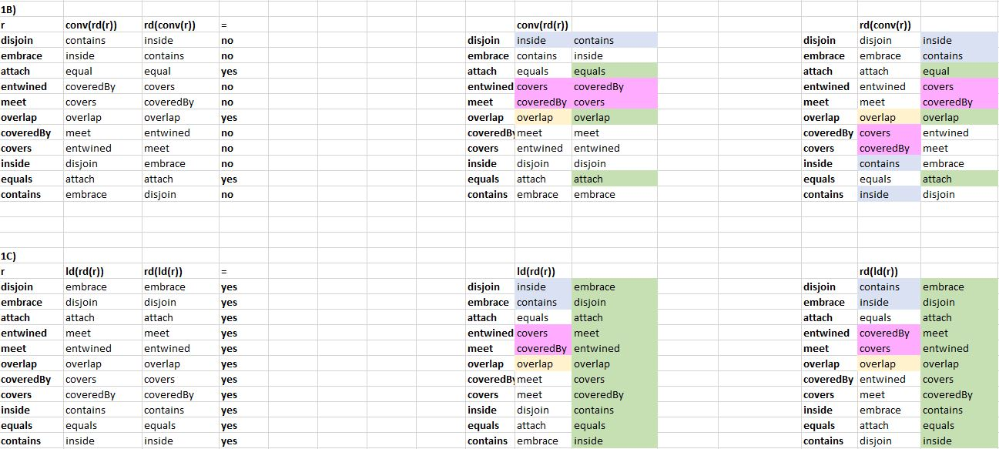
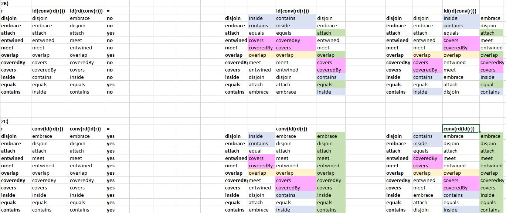

# Conclusions

---

---

A right dual will exchange the interior for the exterior of a 9-intersection matrix of a given relationship always along a vertical line. This results in following pairs of right dual relationships: embrace/ contains, disjoin/ inside, equal/ attach, meet/ coveredBy, covers/ entwines, and the self-right dual of overlap.

---

We can also perform a left dual by exchanging the interior and exterior horizontally along the center line. Performing a left dual on the eleven 9-intersection matrices gives the following pairs: embrace/ inside, disjoin/ contains, attach/ equals, entwined/ coveredBy, meet/ covers, and overlap is a self-left dual.

---

Performing the converse function on a 9-intersection will determine if the given relationship is symmetrical or not. Through exchanging the interior and exterior along a diagonal line, seven self- converse or symmetric pairs are observed and only the converse pairs of coveredBy/ covers, and inside/ contains are non-symmetrical.

---

Although knowing the pairs of the right and left duals, and the converse can help us determine the combinations of these relationships, using it alone is error prone and gets difficult in large problems. To confirm the results in the graph and for the various relationships , a program was developed with functions for a right dual, left dual, and a converse, as well as multidimensional arrays representing the 9-intersection matrices. In using the program, we are able to confirm, and recheck results accurately and determine the outcome of more complicated combinations of relationships.

---

In the included excel graph are the results for the six relationships given. For each of the relationships, the graph gives both the first and final relationships, as well as the intermediary steps. In the included program all of the intermediary steps and their matrices for each relationship can be seen and verified.

---

In adding color to the graph, we can we see some additional patterns. In every column, every relationship is used exactly once, in all six relationships given. There is never a case where there is more than one of the same relationships in a column. When applying the right dual, left dual, or converse to all eleven relationships, we always arrive at full sets of all eleven relationships in each step. In every column the relationships of covers and coveredBy are also directly touching. The other non-symmetric pair of inside and contains are directly touching the majority of the time, but not every time like is the case with covers and coveredBy. Another thing to be observed is the identify matrix of overlap. The relationship of overlap will always result in the matrix of overlap regardless of if a right, left, double dual, or converse is applied. Another observation is the relationship between attach and equal. In every row where the relationship is either equal or attach, every other relationship in that row will either be equal or attach. In knowing the patterns, we are able to deduce with varying degrees of accuracy the relationship or previous relationships based on what pattern are observed.

---

In the ld(rd(r)), rd(ld(r)), conv(ld(rd(r)), conv(rd(ld(r)) for each of the eleven relationships the relationship that was the first and the final relationship were the same. In each of these four situations the first relationship is not always the same as the last relationship in a row, but many times is, however all the relationships that are not symmetrical are paired together. The other pairs that not a self- pair such like, overlap, attach and equals, are paired with the relationship opposite to then on the CNG graphs. For example, embrace/ disjoin, entwined/ meet, covers/ coveredBy, and inside/ contain are, if not connected directly, directly across from each other on the movement, isotropic, and anisotropic CNG charts.

